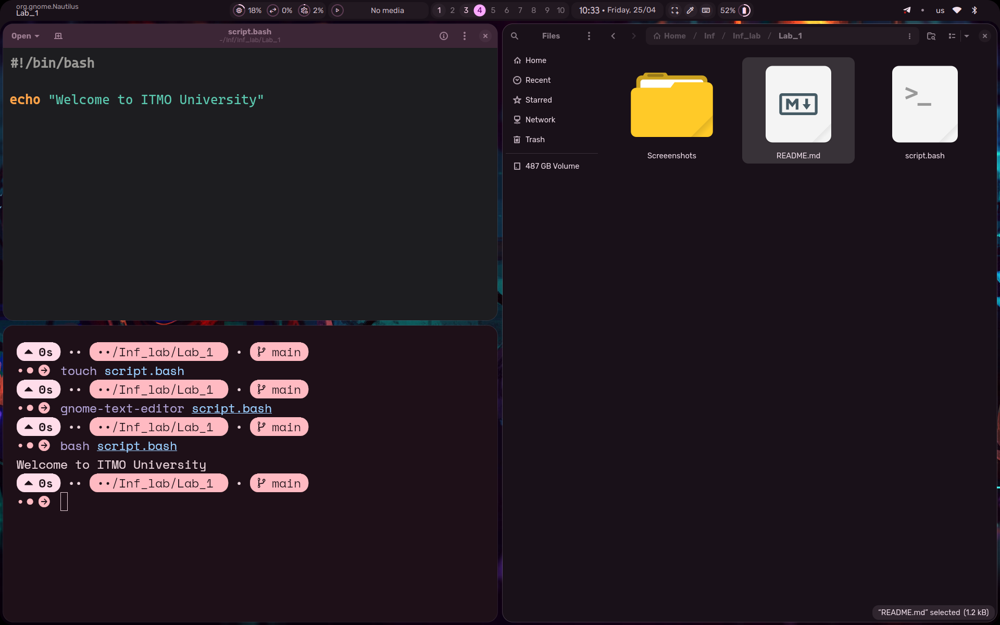
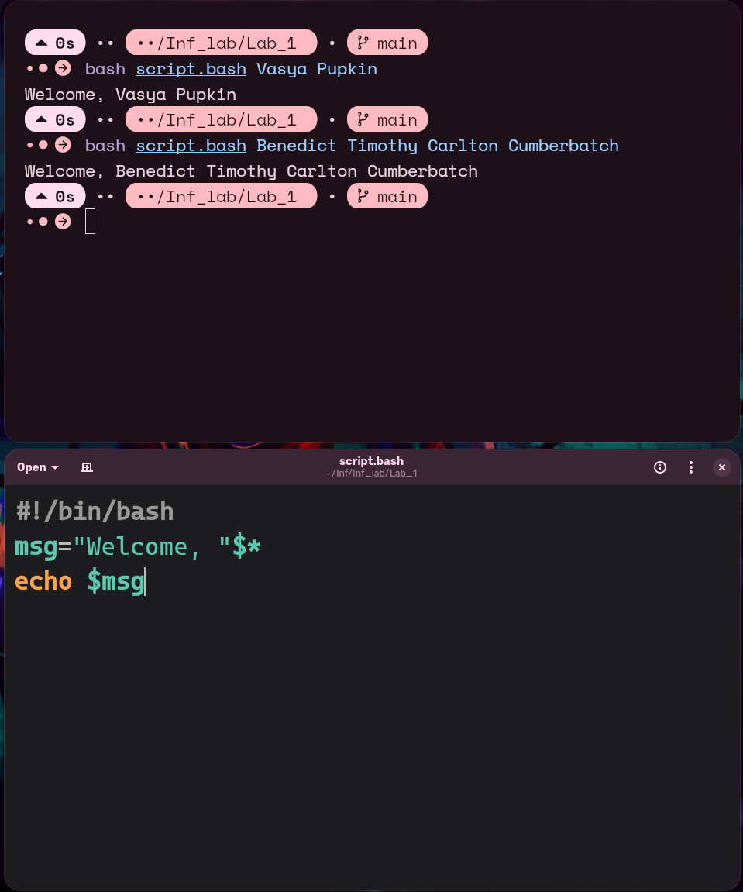

## Лабораторная работа 1

Я установил дистрибутив Arch Linux и все необходимые пакеты.

1. Создал новый файл с именем `script.bash`, вписал следующий скрипт, сохранил его и выполнил в терминале
```bash
#!/bin/bash

echo "Welcome to ITMO University"
```




2. Изменил скрипт под задачу лабороторной работы и выполнил его в терминале



