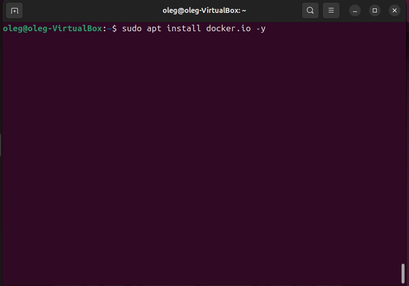
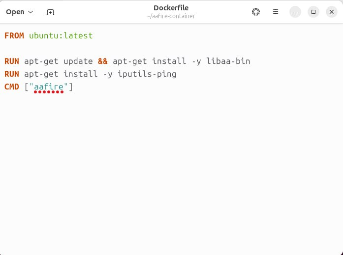
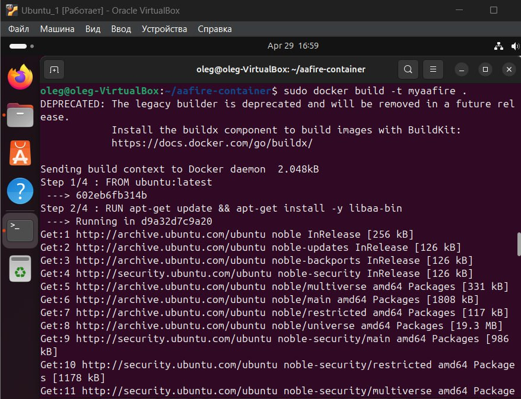
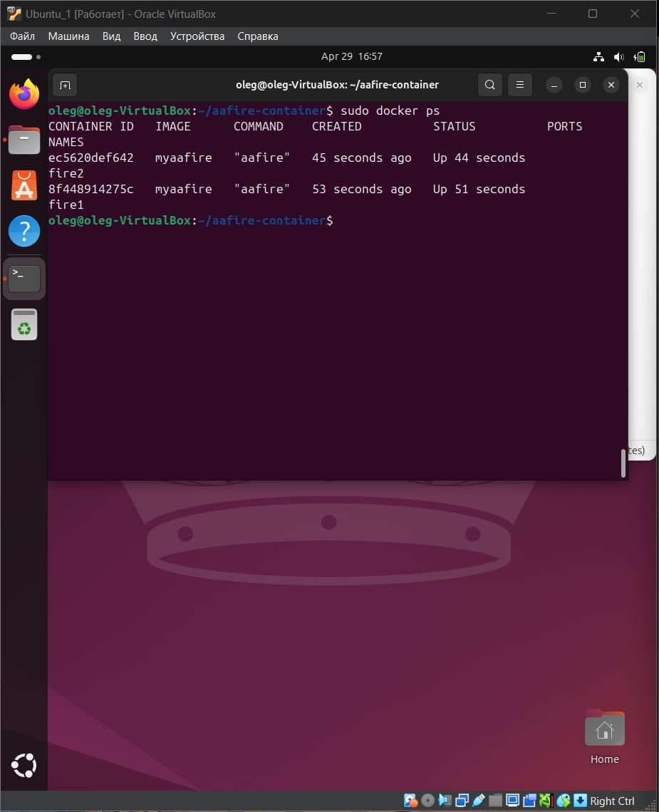
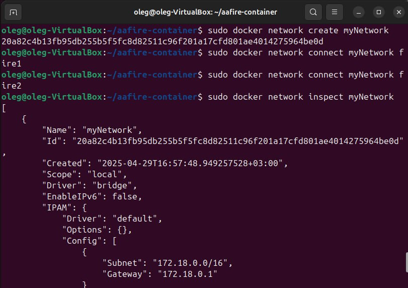
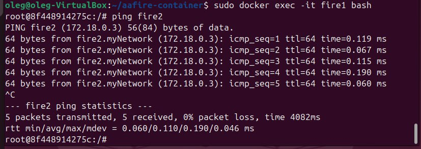

# Лабораторная работа 4

## Работа с Docker: создание и настройка контейнеров

### Описание работы

В данной лабораторной работе были созданы и настроены Docker-контейнеры с графическим приложением, а также организована сеть между ними.
Основная часть
1. Установка Docker

- Скачал и установил Docker на рабочую машину
```bash
sudo apt install docker.io -y
```



- Проверил корректность установки командой:
```bash
docker --version
```


2. Создание Dockerfile

Создан файл Dockerfile со следующим содержимым:
```dockerfile
FROM ubuntu:latest

RUN apt-get update && apt-get install -y libaa-bin
RUN apt-get install -y iputils-ping
CMD ["aafire"]
```


3. Сборка образа и создание контейнеров

Выполнены команды:

- Сборка образа
```bash
sudo docker build -t myaafire .
```



- Создание контейнеров и проверка их работы
```bash
sudo docker run -d --name fire1 aafire_image
sudo docker run -d --name fire2 aafire_image
```

```bash
sudo docker ps
```




4. Настройка сети между контейнерами

- Создана пользовательская сеть:

```bash
sudo docker network create myNetwork
```

- Подключены контейнеры к сети:
```bash
sudo docker network connect myNetwork fire1
sudo docker network connect myNetwork fire2
```

- Сделал анализ сети
```bash
sudo docker network inspect myNetwork
```


5. Проверка соединения между контейнерами

- Вошел в контейнер fire1:

```bash
sudo docker exec -it fire1 bash
```

- Проверил связь с контейнером fire2:

```bash
ping fire2
```

