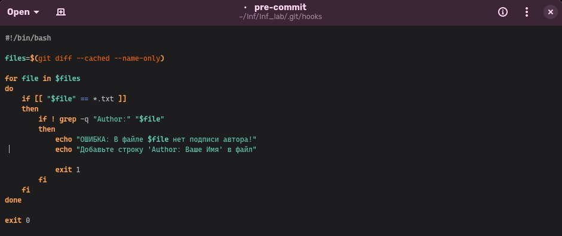
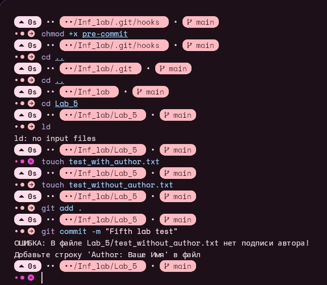
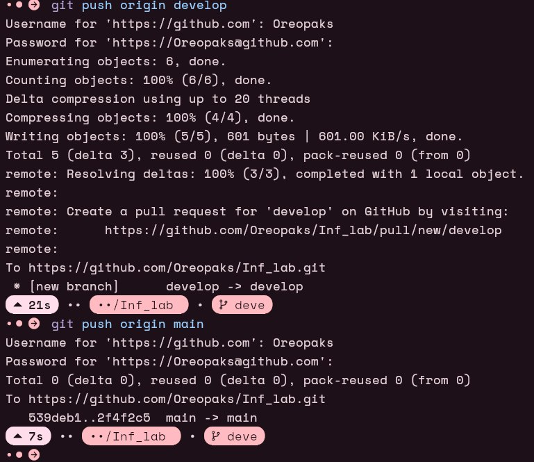
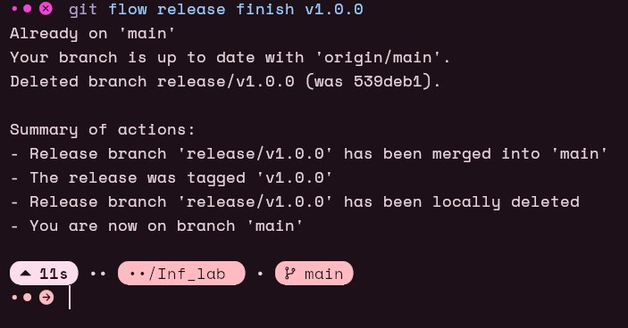

# Лабораторная работа 3
## Автоматизация контроля версий с Git Hooks и Git Flow
### Описание работы

В данной лабораторной работе были освоены два ключевых аспекта работы с Git:

    1. Настройка автоматической проверки файлов при коммите с использованием Git Hooks

    2. Организация workflow разработки с помощью методологии Git Flow

Основная часть
1. Настройка pre-commit hook для проверки .txt файлов
Реализация проверки:

```
#!/bin/bash

files=$(git diff --cached --name-only)

for file in $files
do
    if [[ "$file" == *.txt ]]
    then
        if ! grep -q "Author:" "$file"
        then
            echo "OEM/SKA: В файле $file нет подписи автора!"
            echo "Добавьте строку 'Author: Ваше Имя' в файл"
            exit 1
        fi
    fi
done

exit 0
```


Применение hook:

    Скрипт размещен в .git/hooks/pre-commit

    Назначены права на выполнение:
    bash

    chmod +x .git/hooks/pre-commit


2. Реализация workflow с Git Flow
Инициализация окружения:

    Установка git-flow:
    bash

sudo apt-get install git-flow

Инициализация в репозитории:
bash

    git flow init

Работа с функциональностью:

    Создание feature-ветки:

    git flow feature start task-management

Пример изменений (task_manager.py):
python

```
def create_task(title, description):
    # Логика создания задачи
    print(f"Создана новая задача: {title}")
```
Завершение функциональности:
bash

    git flow feature finish task-management

Процесс релиза:

    Подготовка релиза:

    git flow release start v1.0.0
    echo "v1.0.0" > version.txt

Финализация релиза:

    git flow release finish v1.0.0

Экстренные исправления:

    Создание hotfix:

    git flow hotfix start hotfix-1.0.1

Завершение hotfix:
bash

    git flow hotfix finish hotfix-1.0.1


Скриншоты выполнения:






